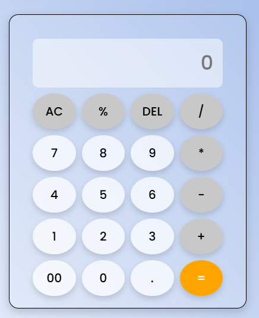

# Basic Calculator

A modern, responsive web-based calculator that supports inline editing, keyboard input, and maintains a calculation history.

## Features

- Basic arithmetic operations: `+`, `-`, `*`, `/`, `%`
- Inline editing using mouse or keyboard (insert or delete at cursor)
- Keyboard support for numbers, operations, `Enter`, `Backspace`, and `Delete`
- Calculation history displayed above the input
- Responsive and glassmorphic UI design
- Error handling (e.g., division by zero shows **"Math Error"**)

## Files Included

- `index.html` — HTML layout for the calculator
- `style.css` — Styled with responsive, modern UI
- `script.js` — Contains core calculator logic
- 
## Screenshot

## How to Use

1. Open `index.html` in your browser.
2. Use on-screen buttons or your keyboard to input expressions.
3. Press `=` or `Enter` to calculate.
4. Press `DEL` or `Backspace` to delete.
5. Press `AC` to clear everything.
---

**Made with ❤️ using HTML, CSS, and JavaScript**
